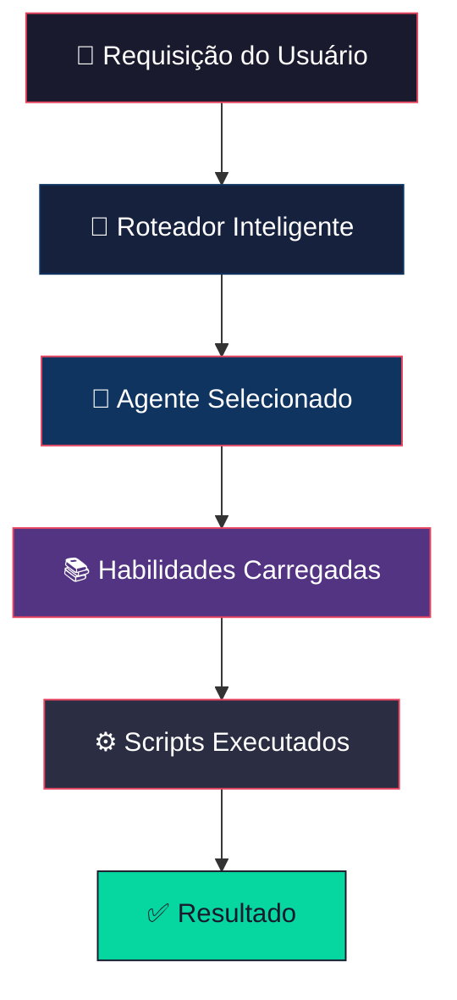
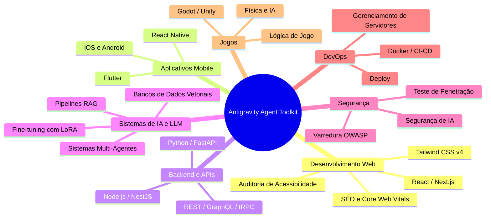
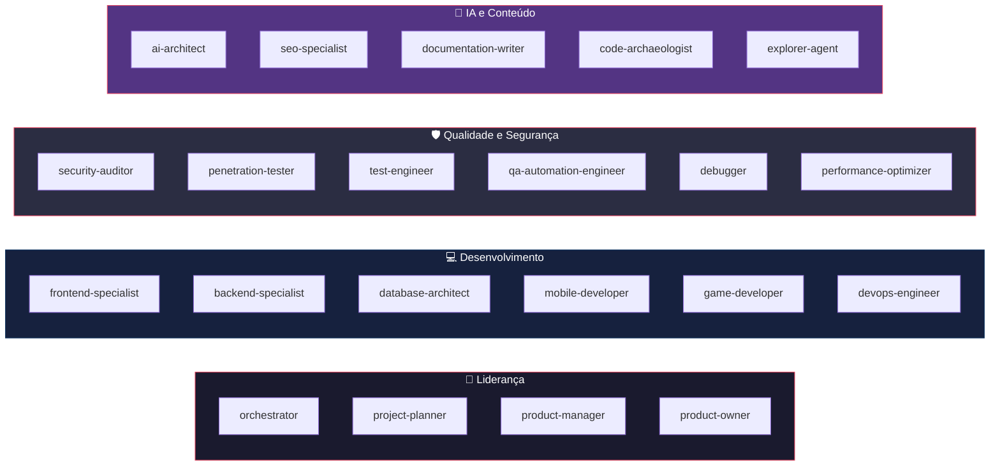
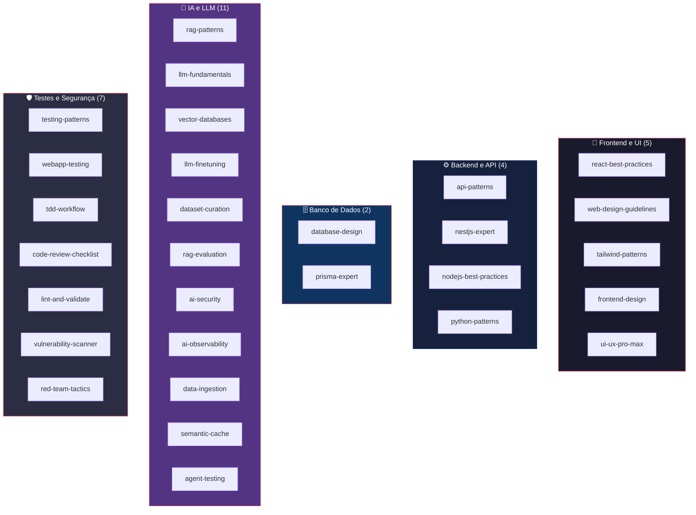
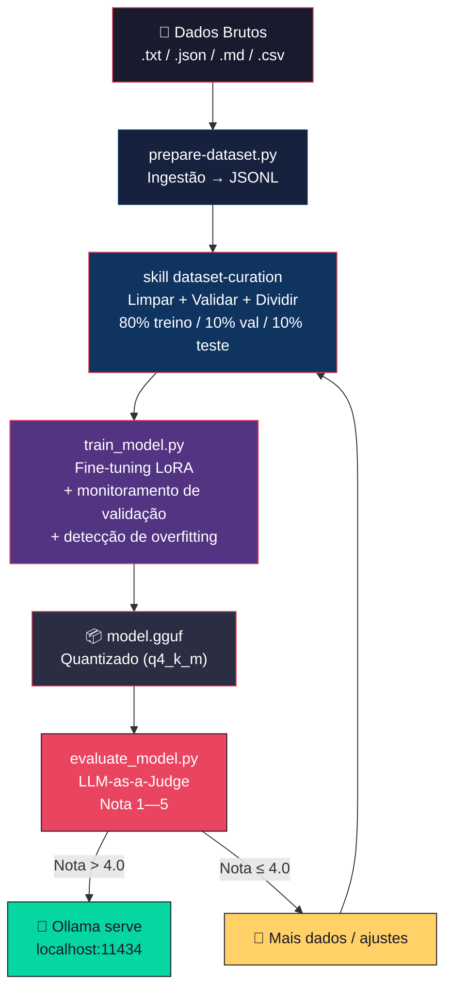
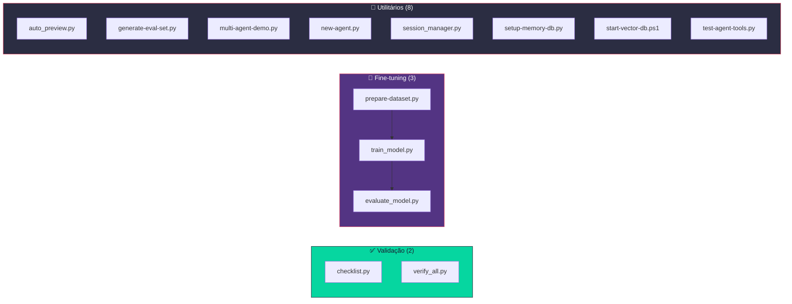
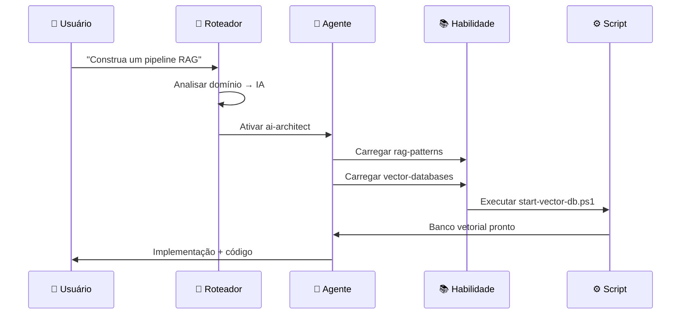
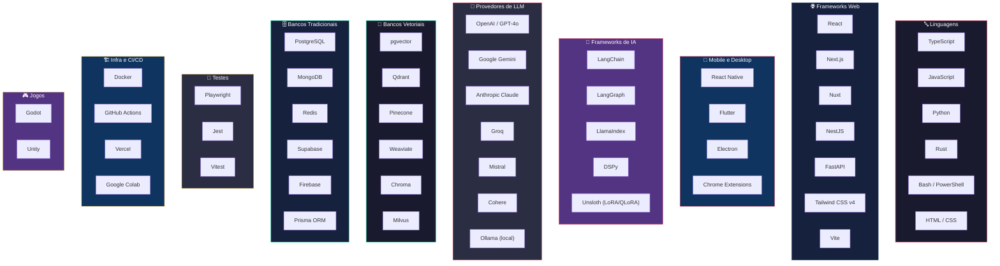
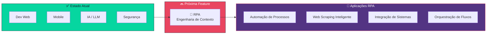

# Antigravity Agent Toolkit — Arquitetura

> **Kit de Ferramentas para Agentes de IA com Desenvolvimento Assistido**
> Transforme qualquer assistente de código IA em um especialista de domínio com 21 agentes, 53 habilidades e 15 fluxos de trabalho.

---

## 🌍 O que é o Antigravity Agent Toolkit?

O Antigravity Agent Toolkit é um **sistema modular de conhecimento** que se conecta ao seu assistente de IA. Ele fornece personas especialistas (Agentes), expertise sob demanda (Habilidades) e procedimentos passo a passo (Workflows) — carregados apenas quando necessário.



### Visão Geral

| Componente | Quantidade | O que faz |
| :--- | :---: | :--- |
| **Agentes** | 21 | Personas IA especialistas (frontend, backend, segurança, IA, etc.) |
| **Habilidades** | 53 | Módulos de conhecimento sob demanda carregados pelos agentes |
| **Workflows** | 15 | Procedimentos passo a passo invocados via comandos slash |
| **Scripts** | 13 | Ferramentas executáveis em Python/Bash/PowerShell |

---

## 🎯 O que Você Pode Construir?

O Antigravity Agent Toolkit cobre o ciclo completo de desenvolvimento de software em **7 domínios de aplicação**:



---

## 🏗️ Estrutura de Diretórios

Todos os arquivos ficam em `.agent/` na raiz do projeto:

```plaintext
.agent/
├── ARCHITECTURE.md              # ← Você está aqui
├── agents/                      # 21 Agentes Especialistas (.md)
├── skills/                      # 53 Habilidades (pasta/SKILL.md)
│   └── <nome-da-skill>/
│       ├── SKILL.md             # Instruções + metadados
│       ├── scripts/             # Automação (opcional)
│       └── references/          # Templates (opcional)
├── workflows/                   # 15 Workflows (.md)
├── scripts/                     # 13 Scripts executáveis
└── rules/                       # Regras globais
```

---

## 🤖 Agentes (21)

Agentes são **personas IA especialistas**. Quando você faz uma requisição, o **Roteador Inteligente** seleciona automaticamente o melhor agente para o trabalho.



### Diretório Completo de Agentes

| Agente | Foco | Habilidades Principais |
| :--- | :--- | :--- |
| `orchestrator` | Coordenação multi-agentes | parallel-agents, behavioral-modes |
| `project-planner` | Descoberta e planejamento | brainstorming, plan-writing, architecture |
| `frontend-specialist` | UI/UX Web | frontend-design, react-best-practices, tailwind-patterns |
| `backend-specialist` | API e lógica de negócio | api-patterns, nodejs-best-practices, database-design |
| `database-architect` | Schema e SQL | database-design, prisma-expert |
| `mobile-developer` | iOS, Android, React Native | mobile-design |
| `game-developer` | Lógica de jogos e mecânicas | game-development |
| `devops-engineer` | CI/CD e Docker | deployment-procedures, docker-expert |
| `security-auditor` | Conformidade de segurança | vulnerability-scanner, red-team-tactics |
| `penetration-tester` | Segurança ofensiva | red-team-tactics |
| `test-engineer` | Estratégias de testes | testing-patterns, tdd-workflow, webapp-testing |
| `debugger` | Análise de causa raiz | systematic-debugging |
| `performance-optimizer` | Velocidade e Web Vitals | performance-profiling |
| `seo-specialist` | Ranking e visibilidade | seo-fundamentals, geo-fundamentals |
| `documentation-writer` | Manuais e documentação | documentation-templates |
| `product-manager` | Requisitos e user stories | plan-writing, brainstorming |
| `product-owner` | Estratégia, backlog e MVP | plan-writing, brainstorming |
| `qa-automation-engineer` | Testes E2E e pipelines CI | webapp-testing, testing-patterns |
| `code-archaeologist` | Código legado e refatoração | clean-code, code-review-checklist |
| `explorer-agent` | Análise de codebase | — |
| `ai-architect` | Sistemas IA, RAG e LLMs | rag-patterns, llm-finetuning, dataset-curation, ai-security, rag-evaluation |

---

## 📚 Habilidades (53)

Habilidades são **módulos de conhecimento sob demanda**. Um agente carrega apenas as habilidades que precisa — mantendo o contexto enxuto e as respostas precisas.



### Habilidades por Domínio

#### 🎨 Frontend e UI

| Habilidade | Descrição |
| :--- | :--- |
| `react-best-practices` | Performance React e Next.js (Vercel — 57 regras) |
| `web-design-guidelines` | Auditoria de UI Web — 100+ regras de acessibilidade e UX |
| `tailwind-patterns` | Utilitários e design tokens do Tailwind CSS v4 |
| `frontend-design` | Padrões de UI/UX e design systems |
| `ui-ux-pro-max` | 50 estilos, 21 paletas, 50 fontes |

#### ⚙️ Backend e API

| Habilidade | Descrição |
| :--- | :--- |
| `api-patterns` | Design de APIs REST, GraphQL e tRPC |
| `nestjs-expert` | Módulos NestJS, DI e decorators |
| `nodejs-best-practices` | Node.js async, módulos e segurança |
| `python-patterns` | Padrões Python, FastAPI e type hints |

#### 🗄️ Banco de Dados

| Habilidade | Descrição |
| :--- | :--- |
| `database-design` | Design de schema, indexação e otimização |
| `prisma-expert` | Prisma ORM e migrações |

#### 🧠 IA e LLM (11 habilidades — todas auditadas 10/10)

| Habilidade | Descrição |
| :--- | :--- |
| `rag-patterns` | Arquiteturas RAG, chunking e busca híbrida |
| `llm-fundamentals` | Tokens, modelos, prompting e janelas de contexto |
| `vector-databases` | Embeddings, HNSW, pgvector, Qdrant e Pinecone |
| `llm-finetuning` | LoRA/QLoRA, 5 modelos base, diagnósticos e deploy |
| `dataset-curation` | Dados sintéticos, limpeza, divisão e validação |
| `rag-evaluation` | LLM-as-a-Judge, golden datasets e RAGAS |
| `ai-security` | Guardrails, mascaramento PII e defesa contra injection |
| `ai-observability` | Rastreamento e monitoramento de apps IA em produção |
| `data-ingestion` | Ingestão de PDF/web, contexto VTEX/ERP |
| `semantic-cache` | Redução de custos LLM via cache semântico |
| `agent-testing` | Testes de agentes IA e mock de respostas LLM |

#### 🛡️ Testes e Segurança

| Habilidade | Descrição |
| :--- | :--- |
| `testing-patterns` | Jest, Vitest e estratégias de teste |
| `webapp-testing` | E2E com Playwright |
| `tdd-workflow` | Desenvolvimento orientado a testes |
| `code-review-checklist` | Padrões de code review |
| `lint-and-validate` | Linting e validação |
| `vulnerability-scanner` | Auditoria OWASP e supply chain |
| `red-team-tactics` | Segurança ofensiva e MITRE ATT&CK |

#### 🏗️ Arquitetura, Cloud e Infraestrutura

| Habilidade | Descrição |
| :--- | :--- |
| `app-builder` | Scaffolding de aplicações full-stack |
| `architecture` | Padrões de design de sistemas |
| `plan-writing` | Planejamento e decomposição de tarefas |
| `brainstorming` | Questionamento socrático |
| `typescript-expert` | Programação em nível de tipos |
| `docker-expert` | Containerização e Compose |
| `deployment-procedures` | CI/CD e workflows de deploy |
| `server-management` | Gerenciamento de infraestrutura |

#### 📱 Mobile e Jogos

| Habilidade | Descrição |
| :--- | :--- |
| `mobile-design` | Padrões de UI/UX mobile |
| `game-development` | Lógica de jogos e mecânicas |

#### 🌐 SEO e Crescimento

| Habilidade | Descrição |
| :--- | :--- |
| `seo-fundamentals` | SEO, E-E-A-T e Core Web Vitals |
| `geo-fundamentals` | Otimização para buscadores GenAI |

#### 🔧 Outras

| Habilidade | Descrição |
| :--- | :--- |
| `clean-code` | Padrões de código (Global — sempre ativo) |
| `behavioral-modes` | Modos operacionais dos agentes |
| `parallel-agents` | Padrões multi-agentes |
| `multi-agent-orchestration` | Coordenação de agentes |
| `agentic-patterns` | Loops de raciocínio e arquiteturas cognitivas |
| `intelligent-routing` | Seleção automática de agentes |
| `mcp-builder` | Servidores Model Context Protocol |
| `prompt-engineering` | System prompts, few-shot e CoT |
| `tool-construction` | Definição de tools para agentes LLM |
| `documentation-templates` | Formatos de documentação e README |
| `i18n-localization` | Internacionalização |
| `performance-profiling` | Web Vitals e otimização |
| `systematic-debugging` | Metodologia de debugging em 4 fases |
| `bash-linux` | Comandos Linux e scripting |
| `powershell-windows` | Windows PowerShell |
| `rust-pro` | Rust 1.75+, Tokio e axum |
| `agent-memory` | Memória de longo prazo e preferências do usuário |

---

## 🔄 Workflows (15)

Workflows são **procedimentos passo a passo** armazenados como arquivos `.md`. Eles guiam o agente em processos de múltiplas etapas.

| Arquivo | Invocação | Descrição |
| :--- | :--- | :--- |
| `brainstorm.md` | `/brainstorm` | Descoberta socrática para projetos e features |
| `build-agent.md` | `/build-agent` | Criar novos agentes especialistas |
| `create.md` | `/create` | Criar novas aplicações |
| `debug.md` | `/debug` | Debugging sistemático |
| `deploy.md` | `/deploy` | Deploy em produção |
| `enhance.md` | `/enhance` | Desenvolvimento iterativo de features |
| `finetune-lora.md` | — | Fine-tune Llama-3 com LoRA no Colab (gratuito) |
| `multi-agent-demo.md` | — | Demo Supervisor → Worker com LangGraph |
| `orchestrate.md` | `/orchestrate` | Coordenação multi-agentes |
| `plan.md` | `/plan` | Planejamento de projetos (sem código) |
| `preview.md` | `/preview` | Gerenciamento do servidor de desenvolvimento local |
| `rag-pipeline.md` | `/build-rag` | Construir pipeline RAG |
| `status.md` | `/status` | Rastreamento de progresso |
| `test.md` | `/test` | Geração e execução de testes |
| `ui-ux-pro-max.md` | `/ui-ux-pro-max` | Design com 50 estilos e 21 paletas |

---

## 🧠 Pipeline de Fine-tuning

O Antigravity Agent Toolkit inclui um pipeline completo de fine-tuning de LLMs, desde a ingestão de dados brutos até o deploy em produção local.



### Scripts do Pipeline

| Script | Finalidade | Uso |
| :--- | :--- | :--- |
| `prepare-dataset.py` | Ingestão de dados → JSONL | `--input raw_data/ --output train.jsonl` |
| `train_model.py` | Fine-tune com LoRA | `--dataset train.jsonl --output model --val-split 0.1` |
| `evaluate_model.py` | Avaliação LLM-as-a-Judge | `--test-set test.jsonl --ft-output predictions.jsonl` |

---

## ⚙️ Scripts (13)

Ferramentas executáveis que automatizam validação e tarefas utilitárias.

### Panorama dos Scripts



### Referência Completa

| Script | Finalidade | Uso |
| :--- | :--- | :--- |
| `checklist.py` | Validação prioritária | `python .agent/scripts/checklist.py .` |
| `verify_all.py` | Suíte completa de verificação | `python .agent/scripts/verify_all.py . --url <URL>` |
| `generate-eval-set.py` | Criar datasets de avaliação | Para conjuntos de eval RAG/LLM |
| `multi-agent-demo.py` | Demo multi-agentes LangGraph | `python .agent/scripts/multi-agent-demo.py` |
| `new-agent.py` | Scaffolding de novos agentes | Gerador de templates de agentes |
| `auto_preview.py` | Servidor de auto-preview | Gerenciamento de dev server |
| `session_manager.py` | Gerenciamento de estado | Sessões de memória do agente |
| `setup-memory-db.py` | Inicializar banco de memória | Vector DB para memória do agente |
| `start-vector-db.ps1` | Iniciar banco vetorial | Script PowerShell |
| `test-agent-tools.py` | Testar definições de tools | Validação de ferramentas |

---

## 🎯 Como Funciona

### Protocolo de Carregamento de Habilidades

Quando você faz uma requisição, as habilidades são carregadas **progressivamente** — não todas de uma vez:



### Estrutura de uma Skill

```plaintext
nome-da-skill/
├── SKILL.md           # (Obrigatório) Metadados + instruções
├── scripts/           # (Opcional) Scripts de automação
├── references/        # (Opcional) Templates e docs
└── assets/            # (Opcional) Imagens e logos
```

---

## 🗺️ Mapa de Cobertura Tecnológica

Todas as tecnologias, frameworks e ferramentas abordadas pelo Antigravity Agent Toolkit:



---

## 📊 Estatísticas

| Métrica | Valor |
| :--- | :--- |
| **Total de Agentes** | 21 |
| **Total de Habilidades** | 53 (11 especializadas em IA/LLM) |
| **Total de Workflows** | 15 |
| **Total de Scripts** | 13 |
| **Auditoria de IA** | RAG 10/10 · Agentes 10/10 · Fine-tuning 10/10 |
| **Cobertura** | ~98% dev web / mobile / IA |
| **Linguagens** | TypeScript, JavaScript, Python, Rust, Bash, PowerShell |
| **Frameworks Web** | React, Next.js, Nuxt, NestJS, FastAPI, Tailwind, Vite |
| **Frameworks IA** | LangChain, LangGraph, LlamaIndex, DSPy, Unsloth |
| **Provedores LLM** | OpenAI, Gemini, Claude, Groq, Mistral, Cohere, Ollama |
| **Bancos Vetoriais** | pgvector, Qdrant, Pinecone, Weaviate, Chroma, Milvus |
| **Bancos de Dados** | PostgreSQL, MongoDB, Redis, Supabase, Firebase |
| **Testes** | Playwright, Jest, Vitest |

---

## 🔗 Referência Rápida

> **"Quero construir X — qual agente e habilidades eu preciso?"**

| Eu Quero... | Agente | Habilidades Principais |
| :--- | :--- | :--- |
| Criar um app web | `frontend-specialist` | react-best-practices, frontend-design, tailwind-patterns |
| Criar uma API | `backend-specialist` | api-patterns, nodejs-best-practices, database-design |
| Criar um app mobile | `mobile-developer` | mobile-design |
| Projetar um banco de dados | `database-architect` | database-design, prisma-expert |
| Auditar segurança | `security-auditor` | vulnerability-scanner, red-team-tactics |
| Escrever testes | `test-engineer` | testing-patterns, webapp-testing, tdd-workflow |
| Debugar um problema | `debugger` | systematic-debugging |
| Planejar um projeto | `project-planner` | brainstorming, plan-writing, architecture |
| Construir um pipeline RAG | `ai-architect` | rag-patterns, vector-databases, rag-evaluation |
| Fazer fine-tune de um LLM | `ai-architect` | llm-finetuning, dataset-curation, ai-security |
| Construir sistema multi-agentes | `orchestrator` | parallel-agents, agentic-patterns, multi-agent-orchestration |
| Otimizar performance | `performance-optimizer` | performance-profiling |
| Melhorar SEO | `seo-specialist` | seo-fundamentals, geo-fundamentals |
| Criar um jogo | `game-developer` | game-development |
| Fazer deploy em produção | `devops-engineer` | deployment-procedures, docker-expert |

---

## 🚀 Próxima Feature: Engenharia de Contexto para RPA

> [!IMPORTANT]
> A próxima grande feature a ser implementada é a **Engenharia de Contexto** com foco em **aplicações RPA** (Robotic Process Automation).

### Visão Geral do Roadmap



### O que será implementado

| Componente | Descrição |
| :--- | :--- |
| **Agente `rpa-engineer`** | Persona especialista em automação robótica de processos |
| **Skill `rpa-patterns`** | Padrões de automação, mapeamento de processos, tratamento de exceções |
| **Skill `context-engineering`** | Engenharia de contexto para IA aplicada a RPA — extração, transformação e injeção de contexto em pipelines de automação |
| **Workflow `build-rpa`** | Fluxo guiado para criar automações RPA do zero |

### Casos de Uso Alvo

- **Automação de processos empresariais** — Invoice processing, data entry, approval workflows
- **Web scraping inteligente** — Extração de dados com compreensão de contexto via LLM
- **Integração de sistemas legados** — Conectar ERPs, CRMs e plataformas via automação
- **Orquestração de fluxos** — Pipelines de automação com fallback inteligente e retry
